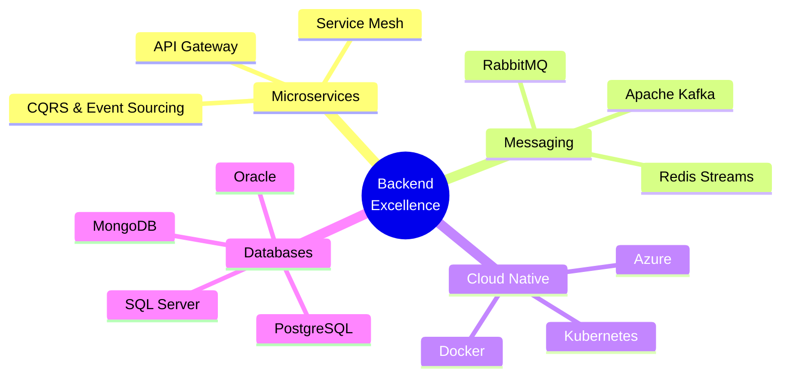

<!-- █████╗ ██████╗ █████╗ █████╗ ███╗   ███╗    █████╗  ██████╗  █████╗ ██╗   ██╗ ██████╗ ███████╗██╗██╗     ██╗ -->
<!-- ╚════██╗██╔══██╗██╔══██╗████╗ ████║   ██╔══██╗██╔════╝ ██╔══██╗██║   ██║██╔════╝ ██╔════╝██║██║     ██║ -->
<!--    ██║██████╔╝███████║██╔████╔██║   ███████║██║  ███╗███████║██║   ██║██║  ███╗█████╗  ██║██║     ██║ -->
<!--    ██║██╔═══╝ ██╔══██║██║╚██╔╝██║   ██╔══██║██║   ██║██╔══██║██║   ██║██║   ██║██╔══╝  ██║██║     ██║ -->
<!--    ██║██║     ██║  ██║██║ ╚═╝ ██║   ██║  ██║╚██████╔╝██║  ██║╚██████╔╝╚██████╔╝███████╗██║███████╗██║ -->
<!--    ╚═╝╚═╝     ╚═╝  ╚═╝╚═╝     ╚═╝   ╚═╝  ╚═╝ ╚═════╝ ╚═╝  ╚═╝ ╚═════╝  ╚═════╝ ╚══════╝╚═╝╚══════╝╚═╝ -->

 

**Senior Backend Architect** • Financial Systems Engineer • Ooredoo Algeria  
**Building scalable, resilient, and secure payment platforms**

 

<!-- Badges -->

  

### 👨‍💻 À propos de moi

<table>
<tr>
<td width="50%" align="center">

#### 🧑‍💻 Identité & Expérience
<strong>Issam Agoudjil</strong>  
Senior Backend Architect @ Ooredoo Algeria  
🇩🇿 Algeria • 10+ ans d'expérience  

**Disponible pour collaborations** sur des projets enterprise

</td>
<td width="50%" align="center">

#### 💡 Philosophie
> "Simplicity is the ultimate sophistication.  
> Every component must serve a purpose, every system must scale gracefully."

 

> "The best code is no code at all.  
> The second best is simple, readable, and maintainable code."

</td>
</tr>
</table>

 

#### 🎯 Domaines d'expertise

| 🏗️ Architecture | ⚙️ Backend | ☁️ Cloud & DevOps | 🗄️ Bases de données | 🛡️ Spécialisation |
|------------------|------------|-------------------|---------------------|-------------------|
| Microservices Event-Driven DDD & CQRS API Gateway | C# / .NET 8 Java / Spring Boot GraphQL Kafka & RabbitMQ | Azure Docker & K8s CI/CD Service Mesh | SQL Server Oracle PostgreSQL MongoDB Redis | Banking Systems Payment Platforms High-Availability Security & Compliance Performance |

 

#### 🏆 Réalisations clés
- Systèmes traitant **1M+ transactions/jour**  
- Latence API réduite à **<100ms**  
- Plateformes à **99.99% uptime**  
- Architectures **Zero-Trust** conformes PCI-DSS & ISO 27001  
- Support de **10M+ utilisateurs actifs**

 

#### 🔥 Focus actuel
Building scalable banking infrastructure • Designing event-driven microservices • Optimizing distributed systems • Implementing zero-trust security

 

#### 📬 Contact
 
 

 

### 🎯 Compétences principales

### 🏆 Réalisations marquantes

| Icône | Réalisation | Impact |
|------|------------|--------|
| 🏦   | Architecture du cœur de paiement Ooredoo | 1M+ transactions/jour, 99.99% uptime |
| ⚡   | Optimisation des APIs critiques | Latence réduite de 70% |
| 🔒   | Mise en place d'une architecture Zero-Trust | Conformité PCI-DSS & ISO 27001 |
| 📈   | Conception d'un système multi-région | Support de 10M+ utilisateurs actifs |

### ⚡ Stack technique

**Backend & Architecture**  

  

**Cloud & DevOps**  

  

**Bases de données**  
  

  

**Frontend & Autres**  

### 📊 Statistiques GitHub

  

  

### 🏗️ Philosophie d'architecture

| 🎯 Design | ⚡ Performance | 🔒 Sécurité | 📈 Scalabilité |
|----------|---------------|------------|---------------|
| Domain-Driven Design Clean Architecture SOLID & Design Patterns | Caching avancé Load Balancing Traitement asynchrone | Zero-Trust OAuth2 / OIDC JWT & Rate Limiting Chiffrement | Cloud-Native Auto-scaling horizontal Service Mesh Multi-région |

### 💼 Projets phares

| Projet | Description | Stack clé | Impact |
|--------|-------------|----------|--------|
| 🏦 **Plateforme de Paiement Ooredoo** | Système de traitement en temps réel avec détection de fraude | .NET 8 • Kafka • Redis • SQL Server | <100ms latency • 99.99% uptime |
| ⚡ **Orchestration Microservices** | Architecture event-driven avec sagas | Spring Boot • Kafka • Kubernetes • Prometheus | 50+ services • Monitoring centralisé |

### 📬 Contact & Collaboration

Ouvert aux collaborations sur des projets enterprise backend, architecture financière ou systèmes distribués.

  

 

⭐ Si mes projets vous intéressent, n'hésitez pas à ⭐ les repositories ! 
Crafted with precision • Engineered with passion • © 2025 Issam Agoudjil

