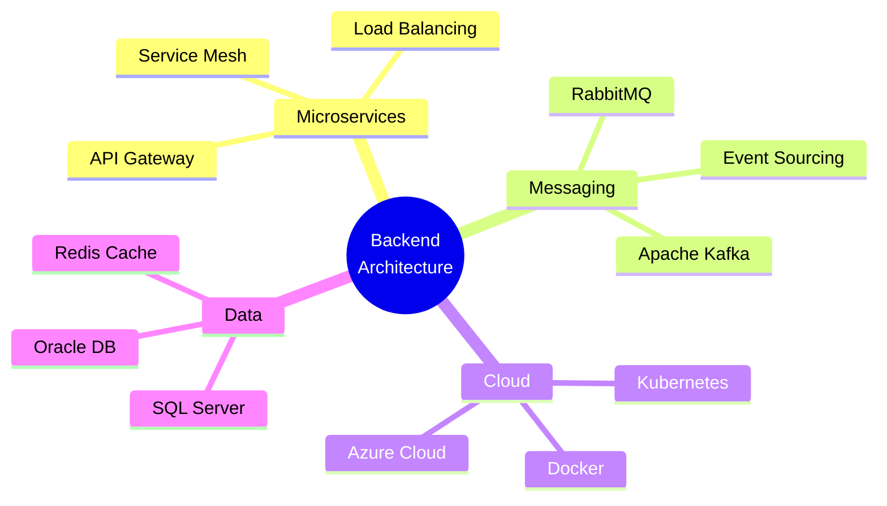

<!-- 
█████╗ ██████╗ ██████╗ ██╗     ███████╗    ██████╗ ███████╗███████╗██╗ ██████╗ ███╗   ██╗
██╔══██╗██╔══██╗██╔══██╗██║     ██╔════╝    ██╔══██╗██╔════╝██╔════╝██║██╔════╝ ████╗  ██║
███████║██████╔╝██████╔╝██║     █████╗      ██║  ██║█████╗  ███████╗██║██║  ███╗██╔██╗ ██║
██╔══██║██╔═══╝ ██╔═══╝ ██║     ██╔══╝      ██║  ██║██╔══╝  ╚════██║██║██║   ██║██║╚██╗██║
██║  ██║██║     ██║     ███████╗███████╗    ██████╔╝███████╗███████║██║╚██████╔╝██║ ╚████║
╚═╝  ╚═╝╚═╝     ╚═╝     ╚══════╝╚══════╝    ╚═════╝ ╚══════╝╚══════╝╚═╝ ╚═════╝ ╚═╝  ╚═══╝
-->

<div align="center">

<!-- Hero Section avec Animation -->


</div>

<!-- Badge Bar Premium -->
<div align="center">
  


[](https://github.com/votre-username)
[](https://github.com/votre-username)
[](https://github.com/votre-username)

</div>

<br/>

<!-- Main Content Grid -->
<table width="100%">
<tr>

<!-- Left Column: Profile & Expertise -->
<td width="50%" valign="top">

<div align="left">

## 👨‍💻 PROFILE.md

```yaml
name: "Issam Agoudjil"
role: "Senior Backend Architect"
company: "OOREDOO ALGERIA"
location: "Algeria"

expertise:
  primary:
    - Banking Software Architecture
    - Microservices Design Patterns
    - Event-Driven Systems
    - Cloud-Native Applications
  
  secondary:
    - API Gateway Design
    - High-Availability Systems
    - Payment Processing
    - Security & Compliance

philosophy: |
  "Simplicity is the ultimate 
   sophistication in code design.
   Every line should serve a purpose,
   every service should scale."

contact:
  email: "Issam.agoudjil@outlook.com"
  linkedin: "agoudjil-issam"
  twitter: "@agoudjilissam"
```

</div>

<br/>

## 🎯 CORE COMPETENCIES

<div align="left">



</div>

<br/>

## 🏆 ACHIEVEMENTS

<div align="left">

| Achievement | Impact |
|------------|---------|
| 🏦 **Banking Platform** | Architected core payment system handling 1M+ daily transactions |
| ⚡ **Performance** | Optimized APIs reducing latency by 70% |
| 🔒 **Security** | Implemented zero-trust architecture |
| 📊 **Scalability** | Designed systems serving 10M+ users |

</div>

</td>

<!-- Right Column: Tech Stack & Stats -->
<td width="50%" valign="top">

<div align="center">

## ⚡ TECH STACK

### Backend Powerhouse

<table>
<tr>
<td align="center" width="96">

<br/>C#
</td>
<td align="center" width="96">

<br/>.NET
</td>
<td align="center" width="96">

<br/>Java
</td>
<td align="center" width="96">

<br/>Spring
</td>
</tr>
<tr>
<td align="center" width="96">

<br/>GraphQL
</td>
<td align="center" width="96">

<br/>Kafka
</td>
<td align="center" width="96">

<br/>RabbitMQ
</td>
<td align="center" width="96">

<br/>Redis
</td>
</tr>
</table>

### Cloud & DevOps

<table>
<tr>
<td align="center" width="96">

<br/>Azure
</td>
<td align="center" width="96">

<br/>Docker
</td>
<td align="center" width="96">

<br/>Kubernetes
</td>
<td align="center" width="96">

<br/>Grafana
</td>
</tr>
</table>

### Database & Storage

<table>
<tr>
<td align="center" width="96">

<br/>SQL Server
</td>
<td align="center" width="96">

<br/>Oracle
</td>
<td align="center" width="96">

<br/>PostgreSQL
</td>
<td align="center" width="96">

<br/>MongoDB
</td>
</tr>
</table>

### Frontend & Mobile

<table>
<tr>
<td align="center" width="96">

<br/>React
</td>
<td align="center" width="96">

<br/>Tailwind
</td>
<td align="center" width="96">

<br/>TypeScript
</td>
<td align="center" width="96">

<br/>Vite
</td>
</tr>
</table>

### AI & Data Science

<table>
<tr>
<td align="center" width="96">

<br/>TensorFlow
</td>
<td align="center" width="96">

<br/>Python
</td>
<td align="center" width="96">

<br/>OpenCV
</td>
<td align="center" width="96">

<br/>Pandas
</td>
</tr>
</table>

</div>

<br/>

## 📊 GITHUB ANALYTICS

<div align="center">


</div>

</td>

</tr>
</table>

<br/>

---

<br/>

<!-- Architecture Philosophy Section -->
<div align="center">

## 🏗️ ARCHITECTURAL PHILOSOPHY

</div>

<table width="100%">
<tr>
<td width="25%" align="center">

### 🎯 Design

**Domain-Driven**

Clean Architecture<br/>
SOLID Principles<br/>
Design Patterns<br/>
DDD Patterns

</td>
<td width="25%" align="center">

### ⚡ Performance

**High-Availability**

Caching Strategies<br/>
Load Balancing<br/>
Async Processing<br/>
CDN Integration

</td>
<td width="25%" align="center">

### 🔒 Security

**Zero-Trust**

OAuth 2.0 / OIDC<br/>
JWT Authentication<br/>
API Rate Limiting<br/>
Encryption at Rest

</td>
<td width="25%" align="center">

### 📈 Scalability

**Cloud-Native**

Horizontal Scaling<br/>
Auto-Scaling<br/>
Service Mesh<br/>
Multi-Region

</td>
</tr>
</table>

<br/>

---

<br/>

<!-- Projects Showcase -->
<div align="center">

## 💼 SIGNATURE PROJECTS

</div>

<table width="100%">
<tr>
<td width="50%">

### 🏦 Banking Core System
**OOREDOO Payment Platform**

- **Tech**: .NET 8, Kafka, Redis, SQL Server
- **Scale**: 1M+ daily transactions
- **Features**: Real-time processing, fraud detection
- **Impact**: 99.99% uptime, <100ms latency

```csharp
// Clean Architecture Pattern
public sealed class ProcessPaymentCommand 
    : ICommand<PaymentResult>
{
    public Money Amount { get; init; }
    public Account Source { get; init; }
    public Account Destination { get; init; }
}
```

</td>
<td width="50%">

### ⚡ Microservices Orchestration
**Event-Driven Architecture**

- **Tech**: Spring Boot, Kafka, Kubernetes
- **Pattern**: CQRS + Event Sourcing
- **Scale**: 50+ microservices
- **Monitoring**: Grafana + Prometheus

```java
@Service
public class OrderEventHandler {
    @KafkaListener(topics = "orders")
    public void handle(OrderCreated event) {
        // Saga orchestration
        sagaManager.start(
            new OrderSaga(event)
        );
    }
}
```

</td>
</tr>
</table>

<br/>

---

<br/>

<!-- Skills Matrix -->
<div align="center">

## 📊 SKILLS MATRIX


</div>

<br/>

---

<br/>

<!-- Contact Section Premium -->
<div align="center">

## 📬 LET'S BUILD TOGETHER

*Open to collaborations on enterprise-grade backend solutions*

<br/>

<table>
<tr>
<td align="center" width="33%">

[](mailto:Issam.agoudjil@outlook.com)

💼 **Professional Inquiries**

</td>
<td align="center" width="33%">

[](https://linkedin.com/in/agoudjil-issam)

🤝 **Network & Connect**

</td>
<td align="center" width="33%">

[](https://twitter.com/agoudjilissam)

💬 **Tech Discussions**

</td>
</tr>
</table>

<br/>

---

### 💭 Latest Thoughts

> *"The best architecture is one that balances complexity with maintainability,*  
> *performance with cost, and innovation with stability."*

---

<br/>

<!-- Activity Graph -->


</div>

<br/>

<!-- Footer -->
<div align="center">


<br/>

**⭐️ If you find my work interesting, consider starring my repositories ⭐️**

<sub>Crafted with precision • Engineered with passion • © 2025 Issam Agoudjil</sub>

<br/><br/>


</div>
